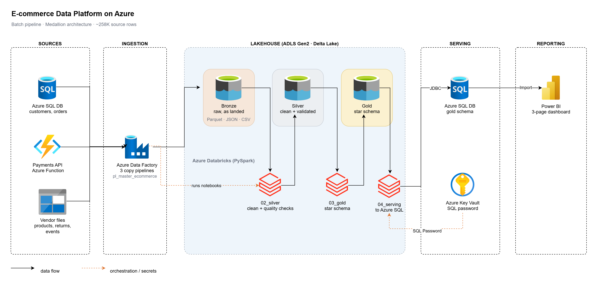
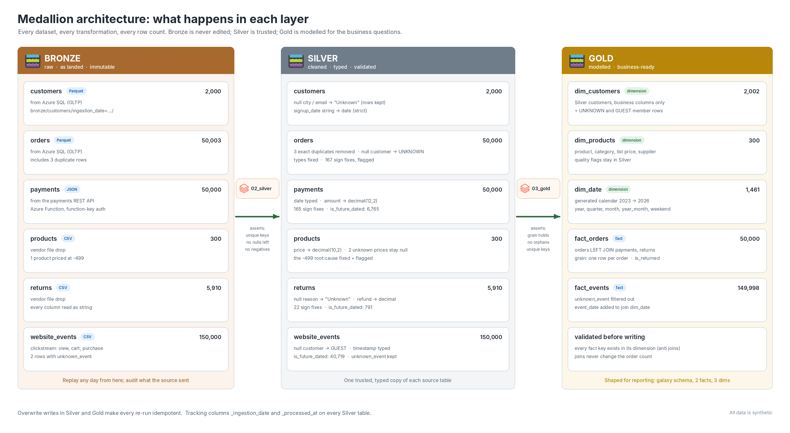
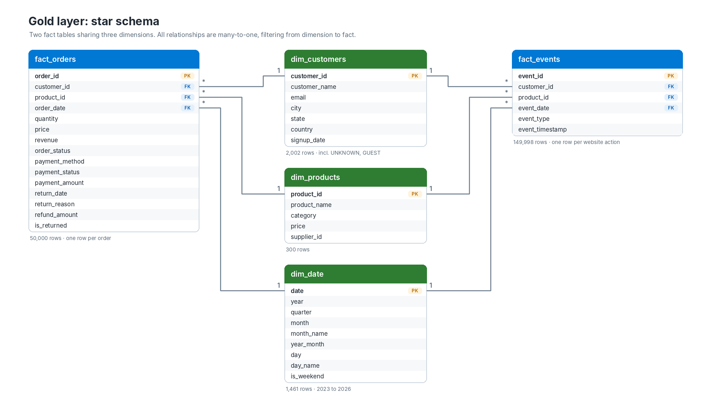
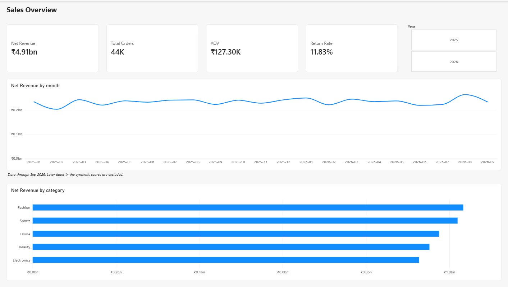
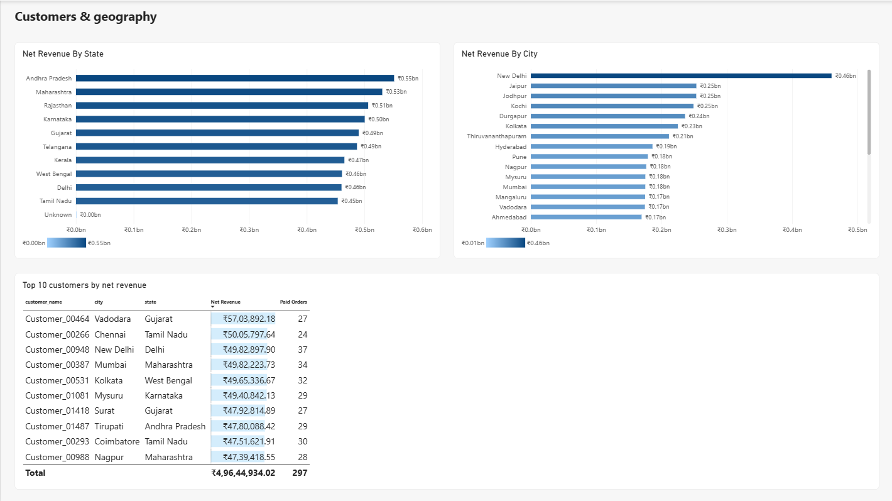
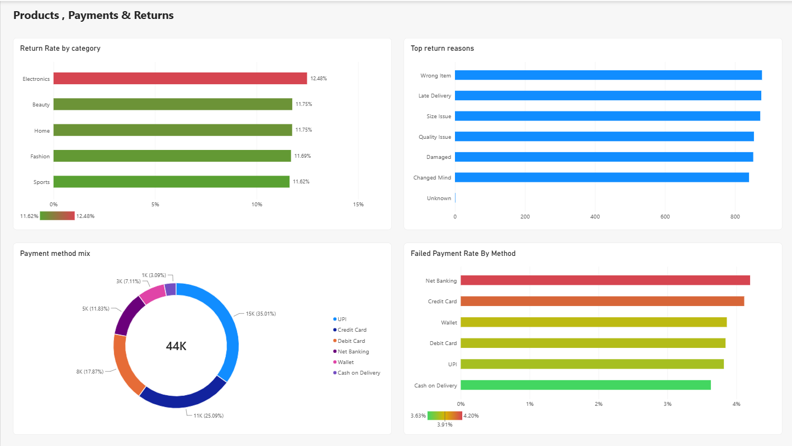

# E-commerce Data Platform on Azure

An end-to-end batch data pipeline for an Indian e-commerce business, built on Azure. Data comes in from three different kinds of sources, goes through a Bronze / Silver / Gold lakehouse on Databricks, is modelled into a star schema, and ends up in a Power BI dashboard. One Azure Data Factory pipeline runs the whole thing, and the pipeline checks its own data quality as it goes.

I built this to learn how the pieces of a real data platform fit together, and to practise the decisions that don't show up in tutorials: what to do with a duplicate row, a missing customer, a negative price, or a date in the future.



## At a glance

| Area | What I used |
|---|---|
| **Sources** | Azure SQL Database (OLTP), a REST API I built with Azure Functions, and vendor CSV files |
| **Ingestion** | Azure Data Factory, three copy pipelines and one master pipeline |
| **Storage** | ADLS Gen2 with Delta Lake, medallion layout (Bronze / Silver / Gold) |
| **Processing** | Azure Databricks, PySpark notebooks |
| **Model** | Galaxy star schema: 2 fact tables, 3 dimensions |
| **Serving** | Azure SQL Database (`gold` schema), loaded over JDBC |
| **Reporting** | Power BI, 3 pages answering 7 business questions |
| **Security** | Azure Key Vault with a Databricks secret scope, no secrets in the repo |
| **Volume** | 6 datasets, about 258,000 source rows |

**Tech:** Python · PySpark · Azure Databricks · Delta Lake · ADLS Gen2 · Azure Data Factory · Azure SQL Database · Azure Functions · Azure Key Vault · Power BI (DAX) · Git / GitHub

## Medallion architecture



**Bronze** holds exact copies of what each source sent, in its original format (Parquet from SQL, JSON from the API, CSV from the files). Every run lands in its own `ingestion_date=YYYY-MM-DD` folder and nothing here is ever edited. If a cleaning step has a bug, I fix the code and re-run from Bronze.

**Silver** is where the cleaning happens. Types are fixed (dates become dates, money becomes `decimal`), nulls are handled, duplicates are removed and bad values are corrected. Every table gets `_ingestion_date` and `_processed_at` columns so any row can be traced back to the run that produced it.

**Gold** is shaped for reporting. It only contains the columns the business needs, plus two special customer rows (`UNKNOWN` and `GUEST`) so that no order or website event gets lost in a join.

Silver and Gold are written with `overwrite`, so running a step twice gives the same result instead of duplicates.

## Orchestration

Everything runs from one ADF pipeline, `pl_master_ecommerce`:

```
run_bronze_sql   ─┐
run_bronze_api   ─┼──►  02_silver  ──►  03_gold  ──►  04_serving
run_bronze_files ─┘
```

- The three Bronze copies run in parallel because they don't depend on each other.
- Each later step only starts if the previous one succeeded, so incomplete or bad data never moves forward.
- ADF passes the run date into the Silver notebook as a widget parameter, so Silver always reads the folder that this run just created. Nothing is hardcoded.
- Copy activities retry twice, 60 seconds apart. I added this after my first orchestrated run failed: the serverless SQL database had auto-paused and timed out while waking up.
- A daily 06:00 IST schedule trigger is configured but kept stopped. The source data is static, so running it every day would only burn compute for the same output. In production it would be started, with failure alerts.

## Data model



| Table | One row is... | Rows |
|---|---|---|
| `fact_orders` | an order, with its payment and its return (if any) | 50,000 |
| `fact_events` | one action on the website (view, add to cart, purchase, remove) | 149,998 |
| `dim_customers` | a customer, plus `UNKNOWN` and `GUEST` | 2,002 |
| `dim_products` | a product | 300 |
| `dim_date` | a calendar day, 2023 to 2026 | 1,461 |

Payments and returns are folded into `fact_orders` instead of being separate tables. Before joining, I checked that every order has exactly one payment and at most one return. If an order ever had two returns, the join would quietly double its revenue, so the notebook asserts this before every run.

The two fact tables have different grains (an order vs a click), so they never join to each other directly. They only meet through the shared dimensions, which means one "Category" filter in Power BI works on both.

## What I found in the data, and what I did about it

I profiled all six datasets before writing any cleaning code: row counts, schemas, key uniqueness, nulls, value ranges, text variants and cross-table relationships. This turned out to be the most interesting part of the project.

**Duplicate orders.** Three orders appeared twice. Before deleting anything, I checked that they were exact copies (distinct whole rows = distinct order IDs = 50,000). If two rows had shared an ID but disagreed on, say, the order status, dropping one at random could keep the wrong version. The notebook now asserts that order IDs are unique, so that situation would stop the pipeline instead of being guessed at.

**Orders with no customer.** Three orders had a null `customer_id`. In a join, null never matches anything, so these orders would silently disappear from every "revenue by state" chart. I found them with a left anti join, mapped them to an `UNKNOWN` key, and added a matching row to `dim_customers`. Website events from visitors who weren't logged in got the same treatment with `GUEST`.

**Negative amounts everywhere.** Orders, payments and returns all had negative values. They were all multiples of 499, which led back to a single product with a price of -499. I fixed the price at the source and flipped the signs downstream, adding a `*_sign_corrected` flag so it's always visible which rows were changed.

**167 vs 165.** After the fix, 167 orders had been corrected but only 165 payments. I traced the gap: 165 came from the bad product, and 2 were sign errors that existed only in the orders table. For those 2, the payment amounts matched the corrected order revenue exactly, which was an independent check that the fix was right.

**Missing values.** Missing cities, emails and return reasons became `"Unknown"`. Missing prices and payment amounts stay null, because filling them with 0 or an average would mean making numbers up.

**Dates in the future.** Some payments, returns and website events were dated after the data was ingested, a side effect of how the data was generated. I flagged them with `is_future_dated`, comparing against the ingestion date rather than today's date, so re-running the pipeline next month gives the same answer. For timestamps I compare only the date part, so an event late on the ingestion day isn't wrongly flagged.

### Quality gates

The notebooks don't just print checks, they assert them. If any of these fail, the notebook fails, ADF marks the run as failed, and nothing bad reaches Gold or the dashboard:

- primary keys are unique in every Silver and Gold table
- no nulls are left in columns that were cleaned
- no negative amounts remain after the sign fix
- joining payments and returns onto orders doesn't change the row count
- every key in a fact table exists in its dimension

Before the pipeline was scheduled, every notebook was run with a cleared state from top to bottom. The first orchestrated run caught a variable that only existed because of an earlier interactive session, which is exactly the kind of bug this is meant to find.

## Dashboard

Power BI reads the `gold` schema from Azure SQL in Import mode. The model mirrors the star schema: six many-to-one relationships, single-direction filters, and a marked date table. Net revenue only counts successful payments, since failed or pending ones never arrived and refunded ones went back to the customer.

**Sales overview:** net revenue, orders, average order value, return rate, monthly trend and revenue by category.



**Customers & geography:** revenue by state and city, and the top 10 customers.



**Products, payments & returns:** return rate by category, top return reasons, payment method mix and failed payment rate.



A few things the data shows: UPI accounts for about 35% of orders, Electronics has the highest return rate (12.5%, roughly a point above the other categories), and Net Banking has the highest share of failed payments. Red-to-green colouring is only used on the two "higher is worse" rate charts, so it means something when it appears.

The report file is [`powerbi/ecommerce_dashboard.pbix`](powerbi/ecommerce_dashboard.pbix). It contains the synthetic data but no credentials.

## Design decisions

**Why the lakehouse is split into three layers.** Raw data is kept untouched so it can always be replayed or audited. Cleaning happens once, in Silver, so every downstream table agrees. Gold is shaped for the questions people actually ask.

**Why overwrite instead of append.** A failed run can simply be re-run without creating duplicates. At larger volumes I'd switch to incremental `MERGE`.

**Why Azure SQL as the serving layer.** I compared it with serving Gold directly through a Databricks SQL warehouse or Microsoft Fabric, which would avoid keeping a second copy of the data. Azure SQL won here because its free tier costs nothing (with overage billing disabled), Power BI connects to it natively, and the dashboard keeps working without any Spark compute running. The trade-off is that the copy has to be kept in sync, which is why it's the last step of the same pipeline.

**Why strict parsing in Silver.** During profiling I used `try_to_date`, so bad values became nulls I could count. In Silver I use `to_date`, so a date in an unexpected format fails the run instead of silently turning into a null.

**Why natural keys.** The source IDs are stable and the data is static, so surrogate keys and slowly changing dimensions would add complexity without changing any answer. With changing customer data I'd add surrogate keys and SCD Type 2.

## Security and cost

The repository is public, so it contains no credentials at all. The SQL password lives in Azure Key Vault, and the serving notebook reads it through a Key Vault-backed Databricks secret scope (if printed, it shows as `[REDACTED]`). The local loader script uses a `.env` file that is git-ignored. ADF connects to Databricks with a token that expires after 30 days and is limited to the clusters, jobs and workspace APIs.

I set a budget alert on day one, and it paid for itself. It caught an always-on NAT gateway, about ₹95 a day even with the cluster switched off, that Databricks had created because Secure Cluster Connectivity was enabled. I traced it in Cost Analysis, recreated the workspace without it, and idle cost dropped to roughly zero. The cluster is single-node and shuts itself down after 15 idle minutes.

## Repository layout

```
adf/            Data Factory pipelines, datasets, linked services and trigger (Git-integrated)
notebooks/      01_explore_bronze, 02_silver, 03_gold, 04_serving
payments_api/   Azure Function that serves the payments data
scripts/        Loads the source tables into Azure SQL
powerbi/        Dashboard file and page screenshots
architecture/   Architecture, medallion and star schema diagrams
```

## Running it yourself

1. Load `customers` and `orders` into an Azure SQL database with `scripts/load_data.py` (credentials go in a local `.env`), deploy the Function in `payments_api/`, and upload the vendor CSV files to a `source-files` container.
2. Store the SQL password in Azure Key Vault and create a Key Vault-backed Databricks secret scope called `kv-ecommerce`.
3. Connect Data Factory to this repository, publish, and run `pl_master_ecommerce`.
4. Check that the row counts in the `gold` schema match the table above.
5. Open `powerbi/ecommerce_dashboard.pbix` in Power BI Desktop and refresh.

## What I'd add next

- Incremental loads with Delta `MERGE` instead of full overwrites
- Carry `is_future_dated` into Gold rather than filtering by a fixed date in the report
- Generate one run date in the master pipeline and pass it to every step
- Build `dim_date` from the actual date range in the data
- Register the tables in Unity Catalog, and use job clusters with a managed identity instead of a token
- Pipeline failure alerts, and CI checks on pull requests
- A conversion funnel page (view → cart → purchase) and RFM customer segments

---

*All data in this project is synthetic and was generated for learning purposes.*
